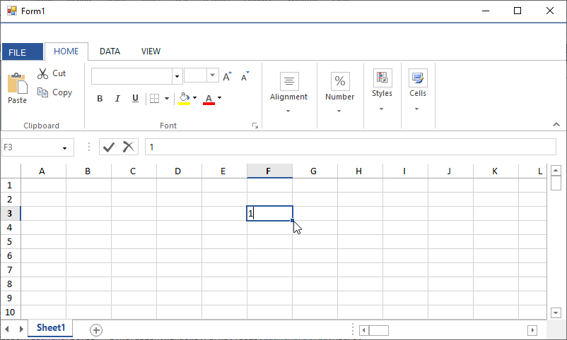
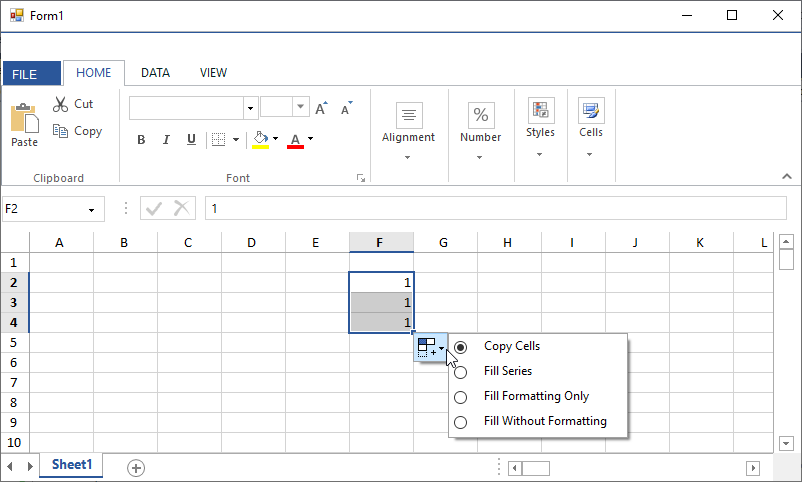

# How to disable fill and copy series in WinForms Spreadsheet?


[WinForms Spreadsheet](https://www.syncfusion.com/winforms-ui-controls/spreadsheet) (SfSpreadsheet) has the built-in support for fill across the row or column cells by dragging the fill handle into the cell containing value or any formula within it. If you want to disable the fill and copy series in **Spreadsheet**, you can set the [AllowFillSeries](https://help.syncfusion.com/cr/windowsforms/Syncfusion.Windows.Forms.Spreadsheet.FillSeriesController.html#Syncfusion_Windows_Forms_Spreadsheet_FillSeriesController_AllowFillSeries) property of [FillSeriesController](https://help.syncfusion.com/cr/windowsforms/Syncfusion.Windows.Forms.Spreadsheet.FillSeriesController.html) to false in [WorkbookLoaded](https://help.syncfusion.com/cr/windowsforms/Syncfusion.Windows.Forms.Spreadsheet.Spreadsheet.html#Syncfusion_Windows_Forms_Spreadsheet_Spreadsheet_WorkbookLoaded) event.

```csharp
//To disable fill series
this.spreadsheet.WorkbookLoaded += Spreadsheet_WorkbookLoaded;
 
private void Spreadsheet_WorkbookLoaded(object sender, Syncfusion.Windows.Forms.Spreadsheet.Helpers.WorkbookLoadedEventArgs args)
{
    foreach(var sheet in args.GridCollection)
    {
        sheet.FillSeriesController.AllowFillSeries = false;
    }
}
```

If you want to disable the fill and copy series in newly added spreadsheet at runtime, you can set the AllowFillSeries property of FillSeriesController to **false** in [WorksheetAdded](https://help.syncfusion.com/cr/windowsforms/Syncfusion.Windows.Forms.Spreadsheet.Spreadsheet.html#Syncfusion_Windows_Forms_Spreadsheet_Spreadsheet_WorksheetAdded) event. 

```csharp
this.spreadsheet.WorksheetAdded += Spreadsheet_WorksheetAdded;
 
private void Spreadsheet_WorksheetAdded(object sender, Syncfusion.Windows.Forms.Spreadsheet.Helpers.WorksheetAddedEventArgs args)
{
    spreadsheet.ActiveGrid.FillSeriesController.AllowFillSeries = false;
}
```

  Below is the screenshot when **AllowFillSeries** is **false**.



  Below is the screenshot when **AllowFillSeries** is **true**.


